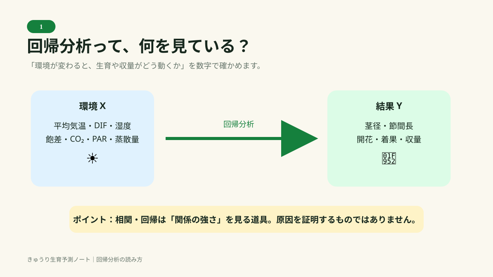
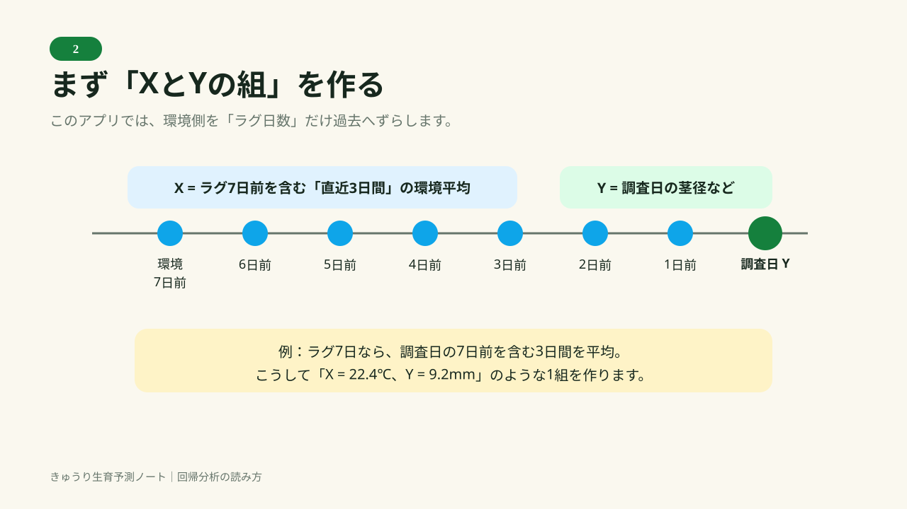
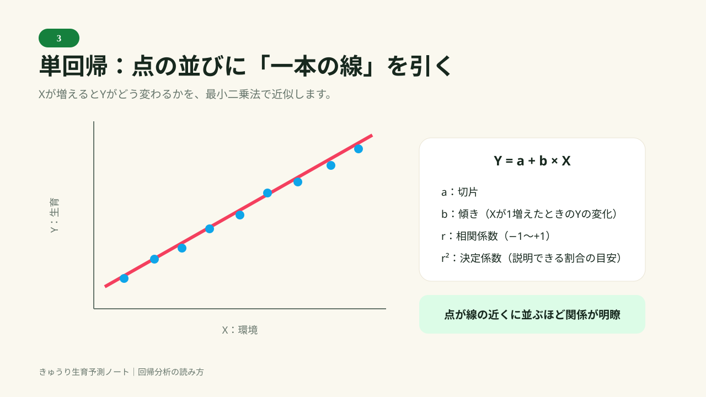
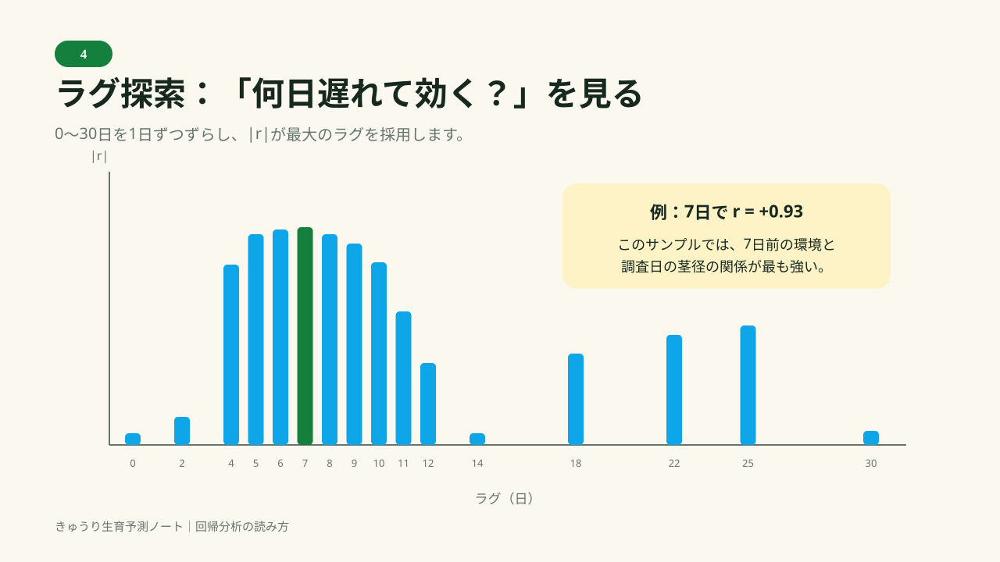
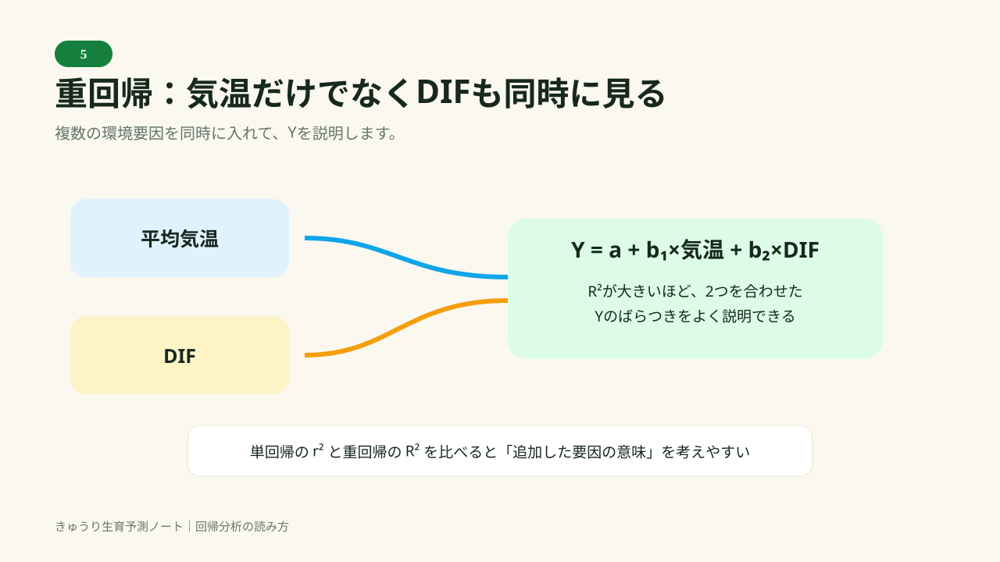
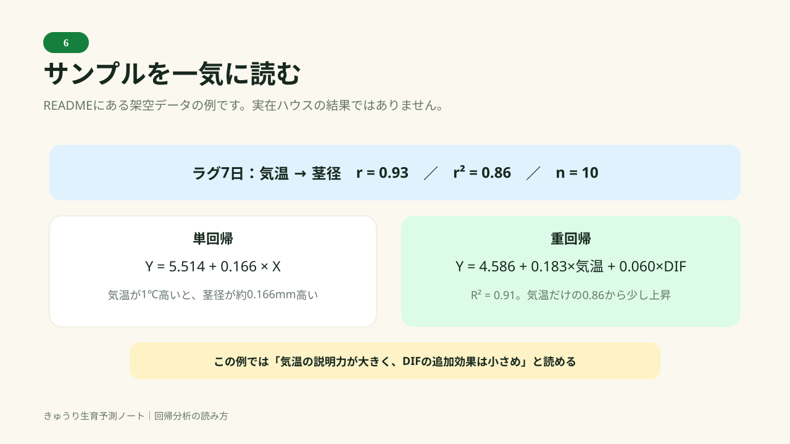
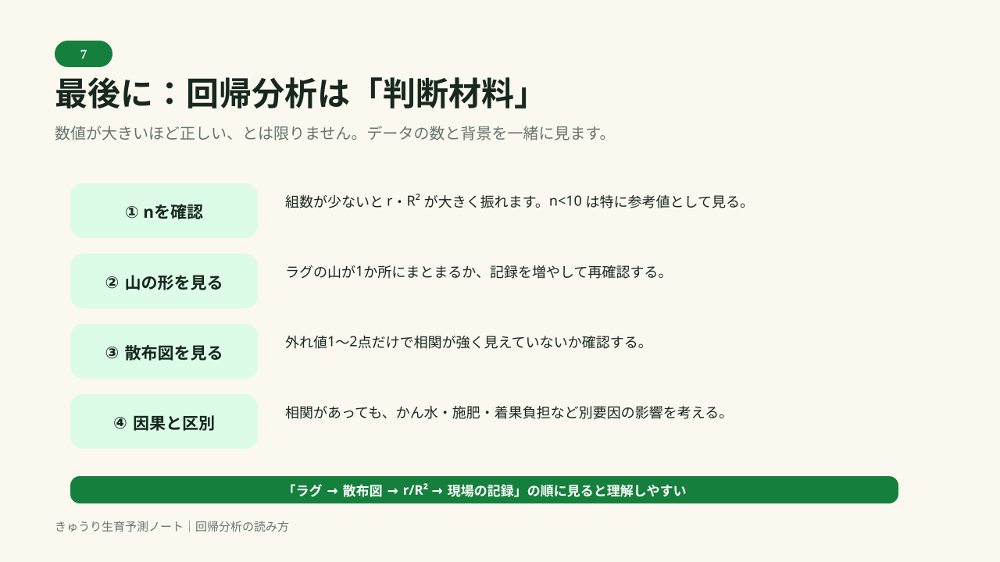

# きゅうり生育予測ノート README

岩手県農業研究センター県北農業研究所 果樹・野菜研究室「[施設きゅうりの摘心栽培における生育予測に基づいた栽培管理法導入マニュアル（ver.1.0）](document/施設きゅうりの摘心栽培における生育予測に基づいた栽培管理導入マニュアル.pdf)」の考え方をもとに作った、生産者向けの試作Webアプリです。ブラウザだけで動く単一のHTMLファイルで、複数ハウスの生育調査・環境データ・かん水量・液肥・回帰分析・カレンダー登録・スプレッドシート同期をまとめて扱います。

県が配布する公式の「きゅうり栽培管理支援ツール」（Excel）そのものではありません。数値の目安はすべて参考値です。実際の管理は、ほ場の状態とpFメーターなどの実測にあわせて調整してください。

ヘッダー右上に「📖 README」（このページ）「✏️ 入力」「📤 出力」の3つのボタンがあります。「✏️ 入力」を押すと入力できるタブの名前が並ぶメニューが開き、選んだタブの入力フォームが大きく表示されます。保存すると、そのタブの結果表示に戻ります。参考資料のマニュアルPDFは、このページ冒頭や画面下部の出典にある「施設きゅうりの摘心栽培における生育予測に基づいた栽培管理法導入マニュアル（ver.1.0）」のリンクから、新しいタブで開けます。リンク先は、このHTMLファイルと同じ場所に置いた `document` フォルダの中の「施設きゅうりの摘心栽培における生育予測に基づいた栽培管理導入マニュアル.pdf」です。以下のようなフォルダ構成にして初めて開けます。

ヘッダー左側のサインイン状況表示（「未サインイン」または自分のメールアドレス）はボタンにもなっていて、押すと未サインインのときは「ログイン」タブへ、サインイン中のときは「ログアウト」タブへ移動します。

「📤 出力」を押すと、4種類のPDF出力（いまの生育／毎日の記録／ハウス内環境／かん水と液肥）をまとめて選べる画面が開きます。どのタブを開いているときでも、ここから直接PDFを出力できます。各タブのカードにある「📄 PDF出力」ボタンは今までどおり使えます（どちらも中身は同じです）。詳しくは8章を参照してください。

回帰分析タブでは、ツールバーの「結果表示／入力」の切り替えボタンの左隣に「📖 解説」ボタンが表示されます。押すと、回帰分析の考え方（組データの作り方、単回帰・重回帰の式、ラグ日数ごとの相関表の読み方、具体的な数値例、注意点）を図表つきでまとめた別ページ「回帰分析の考え方.html」が新しいウィンドウ（タブ）で開きます。内容は5章とほぼ同じですが、グラフや図を交えて読みやすくしたものです。リンク先は、このHTMLファイルと同じ場所に置いた `document` フォルダの中の「回帰分析の考え方.html」です。

```
（このHTMLファイルを置くフォルダ）
├── きゅうり生育予測ノート.html
└── document/
    ├── 施設きゅうりの摘心栽培における生育予測に基づいた栽培管理導入マニュアル.pdf
    └── 回帰分析の考え方.html
```

`document` フォルダやPDFが見つからない場所にHTMLファイルだけを置いた場合、リンクを押すとブラウザの「ファイルが見つかりません」という画面が新しいタブで開きます。アプリの他の機能には影響ありません。

---

## 1. 全体の考え方

マニュアルの核となる考え方は次の3つです。

1. **草勢の強さ**は開花節直下の**茎径**で、**成長のバランス**（栄養成長か生殖成長か）は開花節直下の**節間長**で把握できる。
2. どちらも一定の周期で強い/弱い、栄養/生殖を行き来する。周期の中心（平均値）を「平準点」と呼び、平準点から離れていく方向なら管理を強めに、近づく方向なら弱めに調整することで、生育の振れ幅を小さくできる（＝平準化）。
3. 環境を変えてから生育に表れるまで7〜14日、生育の変化が収量に表れるまで最短7日のタイムラグがある。だから7日間隔で生育調査を行い、14日先までを見通して管理内容を決める。

このアプリは、この3つの考え方をそのまま計算に落とし込んでいます。

---

## 2. タブごとの使い方

### いまの生育
- 上部の2本のメーターが、現在の茎径・節間長が平準点に対してどちら向き・どれくらい離れているかを示します。矢印は「今その値が増えているか減っているか」です。
- 生育調査は、中庸な株を6株選び、株ごとに茎径(mm)・節間長(cm)・開花数・着果数を入力します。全部の欄を埋める必要はありません。
- 「弱小枝を含む」にチェックすると、茎径・節間長の集計が平均値から中央値に切り替わります（マニュアルの推奨どおり）。
- 開花数・着果数は、6株の**合計**として記録されます（平均ではありません。数えた個数の合計です）。
- 収量は「収量 kg」欄に、その調査時点での実測kgを入力します。ハウス一覧で栽培面積（a）を登録しておくと、その下に「収量 kg/10a」が自動計算されて表示されます（入力するのはkgの実数のみで、kg/10aへの換算は自動です）。
- LAI（葉面積指数、任意）を登録すると、「ハウス内環境」タブの蒸散量の計算で、定植からの経過日数のかわりに実際のLAIが使われます（3.3章参照）。潅水量・液肥の実績は、このカードではなく「毎日の記録」タブで記録します。
- 調査が3回たまると、向こう1か月の生育予測と、推奨する栽培管理・変温管理モデルが表示されます。
- カレンダーへの登録は「ログアウト」タブに移動しました。
- ヒーローエリアの下にある「📄 このタブをPDF出力」を押すと、「いまの生育」「向こう1か月の生育予測」「推奨する栽培管理」「このハウスの調査記録」の4つをまとめてPDF出力できます（8章参照）。
- 「このハウスの調査記録」の各行には「編集」ボタンがあります。押すと、その記録の内容がフォームに読み込まれ、見出しが「生育調査を編集する（日付）」に変わります。内容を直して「記録を保存」を押すと、新しい記録としてではなく、もとの記録が更新されます。「入力を消す」を押すと編集を取りやめて、通常の新規入力に戻ります。開花数・着果数は合計だけを保存しているため、編集時は合計値を株1欄にまとめて読み込みます（株ごとの内訳までは復元できません）。
- 「収量 kg」を空欄のまま生育調査を保存すると、表の収量欄には「毎日の記録」から自動集計した値が薄い注記付きで表示されます。集計の範囲は、直前の生育調査日の翌日からその調査日まで（最初の記録の場合は調査日の7日前から）で、生育調査が5〜7日おきという前提に合わせています。この自動集計値は、収量kg/10aの計算やCSV書き出し、回帰分析の「収量」にも使われます。「収量 kg」に自分で数値を入力すると、その値が優先され、自動集計は行われなくなります。
- 「このハウスの調査記録」表には、収量（入力値または毎日の記録からの自動集計値）から計算した「乾物kg」「持出N」「持出P₂O₅」「持出K₂O」も並んで表示されます。計算方法は4.2章の持出養分計算と同じ既定値（乾物率4.0%、N3.0%・P₂O₅1.0%・K₂O5.0%）を使い、記録ごとの収量が変わればその都度連動します。ハウス一覧の「NPK収支（実績）」（4.2章末）で、これらの累計と投入した肥料分を比べられます。

### 毎日の記録
- 生育調査（7日おき・6株測定）とは別に、収量・作業・潅水の実績を日ごとに記録する日誌です。月日、収量kg、作業（あてはまるものすべて）、潅水（使った液肥・使用量L・潅水量L）、メモを記録できます。
- 作業のチェックボックスは「ライブラリ」タブの「作業項目」で管理する一覧から作られます。既定では登録されていないので、初回は「ライブラリ」タブで「既定の7種を入れる」を押すか、必要な項目を登録してください。
- 同じハウス・同じ月日の記録をもう一度保存すると、生育調査と同様に1件に統合されます（別record増えません）。
- 収量と潅水量は、回帰分析のYの選択肢「日次収量」「潅水量」として使えます（5章参照）。
- 「このハウスの毎日の記録」カードの「📄 PDF出力」で、その表だけをPDF出力できます（8章参照）。

### かん水と液肥
- 生育予測と気象データから、その日の株あたりのかん水量（mL/株）を実数で計算します。計算方法は4.1章を参照してください。
- 計算の前提として、マニュアル表2-3（草勢の強さに関連するかん水量の目安）の画像を掲載しています。
- 「いま使う液肥」には、「ライブラリ」タブに登録した液肥を、いまの管理方針（草勢を強める/弱める、栄養成長/生殖成長）に合う順に並べます。
- 「収量予測に基づく持出養分・液肥必要量」では、開始日・終了日（3/5/7/10日のボタンで簡単に設定可能）と見込みの収量（kg）を入力すると、そこから持ち出される乾物量・水分量・N/P2O5/K2O量を計算し、登録した液肥ごとに必要量を比べます。日射比例のかん水量（上）とは別の、期間まとめの計算です。計算方法は4.2章を参照してください。
- 「14日間のかん水計画」カードの「📄 PDF出力」で、「14日間のかん水計画」と「いま使う液肥」をまとめてPDF出力できます（8章参照）。
- 「NPK収支（実績）」は、上の「収量予測に基づく持出養分・液肥必要量」（見込みにもとづく計画）とは別の、**これまでの記録にもとづく実績**の集計です。
  - **投入**：ハウス一覧に登録した元肥（N・P₂O₅・K₂O）と、「毎日の記録」で液肥・使用量を記録した分（その液肥のN/P/K%から計算）を合計します。
  - **持出**：「いまの生育」の生育調査記録それぞれの持出N・P₂O₅・K₂O（収量から計算、上記参照）を、記録がある分すべて合計します。
  - 収支（投入−持出）がプラスなら持ち出した分より多く投入している（過剰気味）、マイナスなら投入より持ち出しの方が多い（不足気味）ことを示し、±30%を超えて偏っている養分は赤字で示します。
  - 元肥を登録していない、または追肥に使った液肥のN/P/K%が未登録・液肥ライブラリから削除済みだと、投入側が過小評価されます。

### 回帰分析
- 環境データ（ハウス内環境タブでCSV取り込み済みのもの）と生育調査記録を組にして、単回帰・重回帰を計算します。計算方法は5章を参照してください。

### ハウス一覧
- ハウスごとに、名前・作型・品種・緯度経度・定植日・栽培終了予定・栽植株数・面積・設備・メモを登録します。
- 緯度経度は外気象の取得に、栽植株数はかん水量をハウス全体の量に換算するときに使います（10aあたりの密度ではなく、そのハウス（圃場）に実際に植わっている株数を入れてください）。
- 栽植株数と栽培面積（a）を両方入れると、株/10a（10aあたりの栽植密度）が自動計算されて表示されます。この株/10aの数値は参考表示で、栽植株数の欄には引き続き圃場の実株数を入力してください。
- カードの上部には、「いまの生育」を簡易にした表示があります。草勢の強さ（開花節直下の茎径）と成長のバランス（開花節直下の節間長）について、現在値（数値を大きく、単位を小さく）、平準点、平準点からの位置を示すメーター、傾向（太く／細く、長く／短くなりつつあるか）を、ハウスごとに並べて確認できます。生育調査が3回そろうまでは、案内が表示されます。
- 「元肥」欄（N・P₂O₅・K₂O、いずれもハウス全体のkg、任意）は、定植前後に施した元肥の量を記録する欄です。ここで登録した値が、「かん水と液肥」タブの「NPK収支（実績）」の投入側（元肥ぶん）に使われます。

### ライブラリ
- 液肥と作業項目の2つを管理するタブです。
- **液肥**：製品名とN・P・K（%）を入れると、N/K比を自動計算します。標準希釈倍率とそのときのEC、使いどころ（草勢を強める/弱める、栄養成長へ/生殖成長へ、基本）を登録できます。「よく使う3種を入れる」でサンプルを登録できますが、成分は実際の製品ラベルに合わせて直してください。
- **作業項目**：「毎日の記録」タブのチェックボックスに使う項目です。自由に追加・編集・削除できます。「既定の7種を入れる」で、ツル上げ・棚線張り・下葉かき・マルチ・カーテンはり・カーテン外し・消毒の7種を一括登録できます。

### ハウス内環境
- 記録計のCSVを取り込みます。気温・湿度・CO₂・日射のうち、あるものだけで構いません。列の対応は自動で推測しますが、確認・修正できます。
- **気温のCSVと湿度のCSVは別々に1回ずつ取り込んでください。** 同じ「値」列1本の書き出し形式（後述）では、2つを同時に選ぶと列の割り当てが片方に引きずられて混ざるおそれがあります。
- 短波放射・直達光・散乱光・風速・風向・雨量をあわせて取り込みたい場合は、このタブではなくOpen-Meteoの取得を一本化した「外気象」タブの「ハウス内環境に取り込む」を使ってください（次節）。
- 取り込んだ値は1時間ごとに平均し、そこから日別の指標を作ります。「ハウス内の推移」表の上にある「ハウス内の推移に表示する項目」で、表示する列をチェックボックスから選べます（「すべて表示」「既定に戻す」ボタンあり）。選べる項目は次のとおりです。

| 項目 | 内容 |
|---|---|
| 日の出・日の入 | ハウス一覧に登録した緯度経度から計算した、その日の日の出・日の入り時刻 |
| 平均・最高・最低 | その日の気温の平均・最高・最低 |
| 昼温・夜温・DIF | 下記参照（固定の6〜18時ではなく、実際の日の出・日の入りで昼夜を分けます） |
| 湿度%・飽差 | その日の平均相対湿度・平均飽差（VPD） |
| CO₂ | その日の平均CO₂濃度 |
| 積算PAR | 下記参照（日積算光量、DLI） |
| 短波放射・直達光・散乱光 | その日の積算日射量（MJ/m²/日） |
| 風速・風向 | その日の平均風速（m/s）・平均風向（ベクトル平均、「225°(南西)」のように方位付きで表示） |
| 雨量 | その日の合計降水量（mm） |
| 蒸散量mm/m²・蒸散量L/株 | 下記（Penman-Monteith法）参照 |
| 時数 | その日にデータがそろっていた時間数 |

風速・風向はOpen-Meteoの地上10mの外気の値で、ハウス内の実際の風とは異なり、下記の蒸散量の計算にも使っていません（想定値0.5m/sを使用）。

**昼温・夜温・DIF・日中の飽差は、ハウス一覧に登録した緯度経度からその日の日の出・日の入り時刻を計算し、日の出〜日の入りを「昼」、それ以外を「夜」として集計しています。** 固定の6〜18時ではなく、季節や地域によって変わる実際の昼夜の境界時刻を使うことで、実態に近いDIF（昼温−夜温）が計算できます。ハウス一覧に緯度・経度を登録していない場合は、代わりに6時〜18時で仮に計算し、その旨が表に注記されます。

**「積算PAR」は、その日の光合成有効放射（PAR）の瞬間値（µmol/m²/s）を、1日ぶん時間で積算した日積算光量（mol/m²/日。DLI＝Daily Light Integralとも呼ばれます）です。** PARの瞬間値そのものは「外気象」タブで直達光・散乱光から次の式で計算し（次節参照）、積算PARはそれを次のように日単位で積算しています。

```
PAR(µmol/m²/s) = (0.43 × 直達光[W/m²] + 0.57 × 散乱光[W/m²]) × 4.6
積算PAR(mol/m²/日) = Σ(その日の毎時のPAR[µmol/m²/s]) × 3600 ÷ 1,000,000
```

直達光と散乱光でPARへの変換係数を分けているのは、散乱光（空からの拡散光）の方が直達光（太陽から直接届く光）よりも光合成に有効な波長を多く含むという一般的な近似にもとづきます。4.6は太陽放射のPAR帯域を光量子束密度（µmol/m²/s）に換算する係数として広く使われる値です。瞬間値を3600（1時間の秒数）倍してµmolからmolへ単位換算（÷1,000,000）してから1日ぶん合計することで、一日を通してハウスに届いた光の総量を表します。値が大きいほど、その日に届いた光の総量が多かったことを示します。実測値との差はセンサーで確認してください。参考として、その日いちばん高かった瞬間値（瞬間最大PAR、µmol/m²/s）はCSV書き出し（7章）に含まれます。
- 「ハウス内の推移」表には蒸散量（mm/日＝L/m²/日）の列があります。実測の気温・湿度と短波放射（日射）から、Penman-Monteith法（FAO56の簡易版）で見積もった推定値です。計算式は3.3章相当として下記のとおりです。

```
Δ（飽和水蒸気圧曲線の勾配, kPa/℃） = 4098 × es(T平均) / (T平均+237.3)²
es(T)（飽和水蒸気圧, kPa） = 0.6108 × exp(17.27×T / (T+237.3))
es（日の代表値） = (es(最高気温) + es(最低気温)) / 2
ea（実際の水蒸気圧, kPa） = es（日の代表値） × 平均相対湿度(%) / 100
Rn（純放射, MJ/m²/日） ≒ 短波放射(MJ/m²/日) × 0.75
蒸散量(mm/日) = 1.0（作物係数） × [0.408×Δ×Rn + 0.066×(900/(T平均+273))×u2×(es-ea)] / [Δ + 0.066×(1+0.34×u2)]
```

FAO56（Allen et al., 1998）で標準化されているPenman-Monteith式を、日単位・地中熱流量ゼロの前提で使っています。実測の気温・湿度から飽和水蒸気圧es・実際の水蒸気圧ea（＝飽差にあたるもの）を直接計算に使えるため、気温と日射だけで見積もる方法（Priestley-Taylor法など）より精度が上がります。u2（風速）はハウス内を想定した固定値0.5m/s（ほぼ無風〜1m/sの中央値）を使っています。実際の風速を測るセンサーがあればより正確になりますが、現状は固定値での近似です。純放射を短波放射の0.75倍とする部分も本アプリの近似です。

**この蒸散量（mm/日）は、ハウス全体の合計ではありません。** 降水量と同じ考え方で、ハウスの床面積1m²あたりの深さ（＝L/m²/日）を表しています。表には「蒸散量mm/m²」に加えて「蒸散量L/株」も並記しています。これは

```
蒸散量(L/株/日) = 蒸散量(mm/日) × 栽培面積(m²) ÷ 栽植株数
```

で、ハウス一覧の栽培面積（a）・栽植株数を両方登録している場合だけ計算されます（どちらか一方でも未登録なら「—」）。

「潅水量と蒸散量の比較」表は、「毎日の記録」でつけた潅水量（ハウス全体L）と、この蒸散量（mm/日）をハウスの栽培面積（m²）で換算したハウス全体Lを、日付をそろえて並べたものです。

```
蒸散量換算(L/日、ハウス全体) = 蒸散量(mm/日) × 栽培面積(m²)
```

両方の値がそろっている日だけ差（潅水−蒸散換算）を計算し、蒸散量換算の半分を超えて差がある日は赤字で示します。潅水が蒸散を大きく上回る日が続けば過湿・排水の目安に、下回る日が続けば乾燥・萎れの目安になります。ただし蒸散量そのものが3.3章の近似計算（風速固定・作物係数の近似など）にもとづくため、絶対値の一致を求めるものではなく、傾向をつかむための比較です。

**作物係数（Kc）は、葉面積指数（LAI）そのものではなく、定植からの経過日数を使った代用の近似です。** ハウス一覧に定植日を登録していれば、

```
Kc = 0.3 + (1.0 − 0.3) × min(定植からの日数, 45) / 45
```

として、定植直後（Kc=0.3、葉が少ない状態）から定植45日後（Kc=1.0、株間が茂って覆われた状態）まで直線的に増やします。45日はつる下ろし・摘心栽培で株間が覆われるまでの目安日数です。定植日が未登録のハウスでは、従来どおりKc=1.0（葉が茂った状態）固定で計算します。実際の葉面積・仕立て方・株間は反映していないため、あくまで生育初期を過大評価しないための簡易な近似です。気温・湿度・短波放射がそろっている日だけ計算されます。
- 「ハウス内の推移」カードの「📄 PDF出力」で、「ハウス内の推移」と「環境と生育のずれ」をまとめてPDF出力できます（8章参照）。
- 「環境と生育のずれ」表は、各調査日の直前14日間の環境平均を並べたもので、タイムラグを目で確認できます。

### 外気象
Open-Meteoからの気象データの取得は、このタブに一本化されています（「ハウス内環境」タブには取得機能はありません）。
- タブを開くと、ハウスの緯度経度をもとにOpen-Meteoから気温・相対湿度・短波放射・直達光・散乱光・風速・風向・雨量を自動で取得し、日の出・日の入り時刻もあわせて計算します（緯度経度が未設定の場合は取得しません）。既定では自動で先14日分を表示します。
- 既定は直近7日の実績＋先14日の予報です。「60日前から」を選ぶと、過去60日分の実績をさかのぼって取得できます。
- 気象データを取得すると、「取り込む開始日」「取り込む終了日」が取得できた全期間（実績＋予報）に自動で設定されます。取り込みたい範囲だけに絞りたいときは、この2つの日付を変更してください（取得済みの範囲外は選べません）。
- 「『ハウス内環境に取り込む』で保存する項目」のチェックボックスで、取り込みたい項目を選べます。「すべて選択」「既定に戻す」ボタンもあります。選べるのは次の11項目です。

| 項目 | 備考 |
|---|---|
| 平均気温・最高気温・最低気温 | 3つとも、内部では同じ1時間ごとの気温データを取り込むかどうかのスイッチです。いずれか1つでもチェックしていれば気温データが取り込まれます |
| 湿度 | 相対湿度 |
| 短波放射 | 全天日射量 |
| 直達光・散乱光 | どちらかを選ぶと、この2つから計算される積算PAR（2章参照）もあわせて自動的に取り込まれます |
| 風速・風向 | 地上10mの外気の値 |
| 雨量 | 降水量 |
| 日の出・日の入 | その日の日の出・日の入り時刻（緯度経度から計算） |

既定（「既定に戻す」で戻る選択）は、平均気温・最高気温・最低気温・湿度・短波放射の5項目です。
- 「ハウス内環境に取り込む」を押すと、確認ダイアログ（OK/キャンセル）が一度表示されます。OKを選ぶと、指定した期間の選んだ項目を、**そのハウスにセンサー実測がない時刻だけ**補完する形で「ハウス内環境」タブのデータに加えます（実測がある時刻を上書きすることはありません）。センサーの記録期間が浅くても、外気の実績で回帰分析やかん水計算の対象期間を広げられます。ただし外気とハウス内では特に湿度が大きく異なるため、目安として扱ってください。

### ログイン
- Googleアカウントでサインインし、スプレッドシートを作成・指定し、「シートから取り込む」で既存データを読み込みます。手順・注意点は6章を参照してください。
- CSV書き出しは、調査記録・環境（時別／日計／週計の3段階）・ハウス一覧・液肥の各CSVと、アプリの引っ越し用の移行用JSON（全データをひとまとめにしたもの）があります。
- このタブには「この端末の内容を送る」（送信）ボタンはありません。送信は「ログアウト」タブから行います。

### ログアウト
- サインイン済みの状態で、「この端末の内容を送る」（送信）を行うタブです。「記録を保存したら自動で送る」を有効にしている場合、直近の自動送信日時もここに表示されます。「シートを開く」を押すと、いま指定しているスプレッドシートをGoogleドライブで新しいタブに開き、送った内容をその場で確認できます。
- 「スプレッドシートと同期」カードの下に「カレンダーへ登録」カードがあります。「いまの生育」（生育調査）と「毎日の記録」それぞれについて、最新の記録・次回の予定をカレンダーに登録したり`.ics`で書き出したりできます。詳しくは6章を参照してください。
- サインアウトする前に確認すべきこと（未送信の変更、バックアップ、複数端末での取り込み漏れなど）を「サインアウトの準備」カードにまとめています。
- このタブには「シートから取り込む」（受信）ボタンはありません。取り込みは「ログイン」タブから行います。

---

## 3. 生育予測の計算方法

### 平準点と振れ幅
そのハウスで記録した茎径（または節間長）の**全記録の平均値**を「平準点」とします。各記録の「平準点からの最大の離れ幅」を振れ幅の基準にし、直近値がその中でどの位置にあるかを −1〜+1 で表したものがメーターの位置です。

### 傾き（増えているか減っているか）
直近3回分の記録を使い、日数を横軸にした最小二乗法の傾きを計算します。傾きがプラスなら「増加中」、マイナスなら「減少中」です。

### 周期と平準点通過日・ピーク日
マニュアル追補1の解析結果にもとづき、茎径は16日、節間長は12日で傾向が切り替わる（＝平準点を通過する）と仮定しています。通過日＝最終調査日＋周期日数、逆の状態のピーク＝最終調査日＋周期日数×2、として表示します。

### 管理方針の決め方
「いま平準点から離れていく方向にある指標は、管理を強めにかけて早めに戻す」という平準化の考え方にもとづき、
- 茎径が増加中（これから「強」のピークへ向かう）→ 草勢を**弱める**方向で管理
- 茎径が減少中（これから「弱」のピークへ向かう）→ 草勢を**強める**方向で管理
- 節間長が増加中（これから栄養成長のピークへ向かう）→ **生殖成長**へ傾ける方向で管理
- 節間長が減少中（これから生殖成長のピークへ向かう）→ **栄養成長**へ傾ける方向で管理

としています。あわせて、マニュアル表2-1の変温管理モデル（Ⅰ〜Ⅵ）から、方向と強度（平準点からの離れ具合）が近いものを1つ選んで提示します。

---

## 4. かん水量・持出養分の計算方法

### 4.1 日射比例かん水量

マニュアル表2-3（日射比例かん水の目安）を出発点にしています。

| 方針 | 係数（mL/株/MJ） |
|---|---|
| 草勢を強める（振れが大きいとき） | 150 |
| 草勢を強める（振れが小さいとき） | 130 |
| 基本 | 110 |
| 草勢を弱める（振れが小さいとき） | 95 |
| 草勢を弱める（振れが大きいとき） | 80 |

この係数に、**飽差補正**をかけます。

```
飽差補正係数 = 1 + (直近7日の日中飽差の平均 − 4.5) × 0.06
（0.85〜1.20の範囲に収める）
```

飽差（VPD、g/m³）は気温・相対湿度から次の式で計算します（ハウス内環境データが必要です。外気データのみでは計算されません）。

```
飽和水蒸気圧 es = 6.1078 × 10^(7.5×T / (237.3+T))    [hPa]
飽和水蒸気量   = 217 × es / (T + 273.15)              [g/m³]
飽差           = 飽和水蒸気量 × (1 − 相対湿度/100)
```

最終的な**当日のかん水量**は、

```
mL/株/日 = 係数 × 飽差補正係数 × 当日の日射量(MJ/m²)
ハウス全体 L = mL/株/日 × 栽植株数 ÷ 1000
```

かん水回数は「日射量(MJ) ÷ 1.2」を目安に1〜14回の範囲で割り振り、1回あたりの量も表示します。日射量はOpen-Meteoの短波放射予報（W/m²を時間積算してMJ/m²に換算）を使います。

### 4.2 収量予測に基づく持出養分・液肥必要量

こちらは日射比例かん水（4.1）とは別の、期間まとめの計算です。マニュアルには記載がなく、本アプリで独自に組み立てた参考計算です。

見込み収量を入力すると、まず乾物量を計算します。

```
乾物量(kg) = 見込み収量(kg) x 乾物率(%) / 100
水分量(kg) = 見込み収量(kg) - 乾物量(kg)
```

乾物率の既定値は4.0%（きゅうり果実はおよそ95〜96%が水分という一般的な目安にもとづく参考値）です。次に、その乾物に含まれる養分の割合から、持出N・P2O5・K2Oを計算します。

```
持出N(kg)    = 乾物量(kg) x N含有率(%)   / 100
持出P2O5(kg) = 乾物量(kg) x P2O5含有率(%) / 100
持出K2O(kg)  = 乾物量(kg) x K2O含有率(%)  / 100
```

乾物率・N/P2O5/K2O含有率はいずれも「乾物率・養分含有率の目安を調整する」から編集できます。既定値（N 3.0%、P2O5 1.0%、K2O 5.0%）は一般的な参考値であり、地域のJA施肥基準や分析値があればそちらに合わせて調整してください。

続けて、登録した液肥ごとに必要な原液量を計算します。Nを基準に、その製品だけで持出N分を満たすには何L（比重1kg≒1Lとみなした概算）必要かを求め、その量を使ったときにP2O5・K2Oがどれだけ供給されるか（充足率、100%で過不足なし）もあわせて表示します。

```
必要量(L) = 持出N(kg) / (その液肥のN% / 100)
供給P2O5(kg) = 必要量(L) x (その液肥のP% / 100)
供給K2O(kg)  = 必要量(L) x (その液肥のK% / 100)
P充足率(%) = 供給P2O5 / 持出P2O5 x 100　（K2Oも同様）
```

充足率が70〜150%の範囲から外れている場合は赤字で表示されます。その液肥1種類だけでは養分バランスに偏りが出ることを示しているので、複数の液肥を使い分けるか、別の製品を検討する目安にしてください（きゅうりはK2Oの要求量が多いため、一般的なN-P-K配合の液肥だけではK2O充足率が低く出ることがよくあります）。

対象期間は、開始日・終了日をカレンダーから直接選ぶ方式です。よく使う3日・5日・7日・10日はボタン一つで終了日を自動設定します（開始日＋日数−1）。もちろん終了日を手で直して、これ以外の任意の日数にすることもできます。

「直近の収量記録から入れる」を押すと、生育調査で記録した収量から見込み収量を仮に入れます。収量記録が2件以上あれば、記録間の日数から1日あたりの収量を見積もり、いま選んでいる対象期間の日数ぶんに換算します。1件しかない場合は、その値をそのまま使います。

---

## 5. 回帰分析の考え方


### 📊 スライドで理解する回帰分析

回帰分析は、**「環境の変化が、何日後の生育や収量に、どのくらい関係しているか」**をデータから確かめるための道具です。
このアプリでは、まず環境データをラグ日数だけ過去にずらして生育・収量と組み合わせ、そのうえで単回帰・重回帰を計算します。

> **読み方の基本：**  
> **① ラグを見る → ② 散布図を見る → ③ r / r² / R²を見る → ④ 現場の記録と照らし合わせる**

#### スライド1｜回帰分析の全体像



#### スライド2｜XとYの「組」を作る



#### スライド3｜単回帰



#### スライド4｜ラグ探索



#### スライド5｜重回帰



#### スライド6｜サンプルデータを読む



#### スライド7｜現場での読み方



**このスライドの位置づけ**

- このスライドは、下に続く「組データの作り方」「単回帰」「ラグ日数ごとの相関」「重回帰」「具体例」を先に直感的に理解するための導入です。
- 数式・ラグの定義・nの注意点などの詳細は、下の技術説明を参照してください。
- 回帰分析は因果関係を証明するものではなく、栽培管理の判断材料として使います。

### 組データの作り方（共通）
生育調査の各記録（日付・集計後の茎径や節間長など）に対して、「ラグ日数」だけ過去にさかのぼった環境データを対応させます。環境側は、その日を含む**直近3日間の平均**を使い、日々のノイズをならしています。

Yに「日次収量」「潅水量」を選んだ場合だけ、日付の基準が生育調査ではなく**「毎日の記録」の日付**に変わります（それ以外の組み方は同じです）。生育調査は7日おきしかありませんが、毎日の記録は日々つけられるため、収量・潅水と環境の関係はより多くの組数で調べられます。

```
X の値 = mean( 環境値[調査日 − ラグ], 環境値[調査日 − ラグ − 1], 環境値[調査日 − ラグ − 2] )
```

### 単回帰
X（平均気温・昼温・夜温・DIF・相対湿度・飽差・CO₂濃度・積算PAR・蒸散量から1つ）と Y（茎径・節間長・開花数・着果数・収量・日次収量・潅水量から1つ）の組から、最小二乗法で

```
Y = a + b × X
```

を求め、相関係数 r、決定係数 r²、組の数 n を表示します。「0〜30日を自動で探索」を有効にすると、ラグ日数を0〜30日で1日ずつ動かし、|r| が最大になる日数を自動採用します。

### 「ラグ日数ごとの相関（単回帰）」カードの見方
回帰分析タブの右側（結果の下）に出る表です。「0〜30日を自動で探索」にチェックが入っているときだけ表示されます（チェックを外して手動でラグ日数を決めているときは出ません）。**「環境を変えてから、何日後の生育（または収量）にいちばん強く表れているか」を一覧で確かめるための表**で、「結果」カードで採用されたラグ日数がなぜそれに決まったのか、を確認する根拠になります。

**1行の意味。** 1行が1つのラグ日数（0日〜30日）です。たとえば「7日」の行は、各調査日の7日前（を含む直近3日間）の環境値をXとし、その調査日のYと組にして相関係数 r を計算した結果です。つまり、ラグ日数を0日から30日まで1日ずつずらしながら、上の「組データの作り方（共通）」のとおり31通りの単回帰を作り、それぞれの r だけを並べたものです。表に出ているのは r だけで、回帰式や切片・傾きは載りません。

**列の意味。**

| 列 | 意味 |
|---|---|
| ラグ | 環境の変化から何日さかのぼったXを使ったか |
| r | そのラグでの相関係数（−1〜+1）。+ならXが高いほどYも高い、−ならXが高いほどYは低い。0に近いほど関係がない |
| 強さ | rを横棒で示したもの。中央の縦線が r = 0、右へ伸びるほど正の相関、左へ伸びるほど負の相関 |

**緑色にハイライトされた行。** 「結果」カードや散布図に採用されているラグ日数です。自動探索では、|r|（rの絶対値）がもっとも大きいラグが選ばれます。正か負かは問わず「関係の強さ」だけで選ぶため、たとえば r = −0.82 のラグは r = +0.75 のラグより優先されます。傾きの向きは、結果カードの「傾きの意味」で確認してください。

**横棒（強さ）の見方の注意。** 棒の長さは、その表の中でいちばん大きい|r|を端（約46％）とする**相対的な長さ**です。r = ±1 を端にしているわけではありません。そのため、全体的に相関が弱くて最大が0.3程度でも、その行の棒は端まで伸びます。「棒が長い＝強い相関」とは限らないので、強さは必ず r の数値で判断してください（目安は、結果カードと同じく |r| が0.7以上で強い関係、0.5以上で関係あり、0.3以上で弱い関係、それ未満は関係が弱い）。また、条件（XやY）を変えると棒の基準も変わるので、別の条件どうしを棒の長さで比べることはできません。

**表からわかること・読み方の例。**

| 表の形 | 考えられる意味 |
|---|---|
| 特定のラグ付近（たとえば6〜10日）で山（または谷）になり、その前後で徐々に下がる | 環境の変化が、その日数ぶん遅れて生育に表れている可能性が高い。マニュアルの「環境から生育まで7〜14日」とも合えば、なお信頼しやすい |
| 山が複数ある、またはギザギザで規則性がない | 偶然の並びの可能性が高い。組の数を増やして見直す |
| 0日に近いところが最大 | 遅れなく同時に動いている、あるいは季節や日長など別の要因に引きずられている可能性 |
| どのラグでも r の絶対値が小さい（0.3未満） | そのXとYの間に、この記録の範囲では目立った直線的な関係がない |
| ラグを大きくするほど r の絶対値が単調に大きくなる | 季節の変化など、時間とともに一方向に動く別の要因が影響している可能性。ラグの効果とは限らない |

**組の数 n に注意。** ラグ日数が大きくなるほど、環境データが必要な期間が昔にずれます。環境データが記録の始まりより前までない場合、その調査日は組にできず、組の数 n が減ります（組が3組未満になるラグは表に出ません）。このカードには n を表示していないため、環境データを取り込んだ期間と調査日の数から、大きなラグでは組が少なくなっていることを頭に入れて見てください。組が少ないと r は偶然でも大きく振れます。参考として、「相関がない」と仮定したときに偶然で出にくい（危険率5％の両側検定）rの目安は次のとおりです。

| n（組の数） | 5 | 8 | 10 | 15 | 20 | 30 |
|---|---|---|---|---|---|---|
| r の絶対値がこれ未満だと偶然の可能性が残る | 0.88 | 0.71 | 0.63 | 0.51 | 0.44 | 0.36 |

これは「あらかじめ決めた1つのラグ」を調べた場合の目安です。31通りのラグから最大のものを選ぶと、偶然でも大きめの r が出やすくなるため、実際にはこの値よりさらに厳しく見る必要があります。**n が10未満のときは、表の最大値をそのまま信じず、「傾向を見る参考」にとどめてください。**

**使い方のコツ。**
1. まず「Y」を茎径または節間長、「X」を平均気温やDIFにして、自動探索で表を出します。
2. 山になっているラグが、マニュアルの目安（7〜14日）の範囲にあるか確認します。
3. 山が1つはっきり見えたら、そのラグの散布図（点が右上がり／右下がりにそろっているか）も見ます。r が大きくても、1〜2点の外れ値に引っ張られているだけのことがあります。
4. 記録（調査日）が増えたら見直します。組が増えるほど、山の位置は安定します。

この表はあくまで「線形の相関」を見るもので、原因と結果を証明するものではありません（相関があっても、片方がもう一方の原因とは限りません）。重回帰にも同じ考え方の「ラグ日数ごとのR²」の表があります。こちらは r の代わりに、選んだ2つの説明変数を同時に使ったときの決定係数 R²（0〜1、大きいほどよく説明できる）を、ラグ日数ごとに並べたものです。

### 重回帰
単回帰では環境要因を1つしか見られませんが、実際の生育は複数の環境要因の組み合わせで動きます。そこで、X1・X2の2つの環境側変数（単回帰と同じ9項目、平均気温・昼温・夜温・DIF・相対湿度・飽差・CO₂濃度・積算PAR・蒸散量から選べます。X1・X2には異なる項目を選ぶ必要があります）を同時に説明変数とする重回帰

```
Y = a + b1×X1 + b2×X2
```

を最小二乗法（3元の正規方程式をクラメルの公式で解く）で計算します。既定はX1＝平均気温、X2＝DIFで、これは気温とDIF（昼夜温差）の組み合わせという、マニュアルでもよく参照される代表的な組を初期値にしたものです。決定係数R²は、X1とX2の両方を使ったときにYのばらつきをどれだけ説明できるかを示します。単回帰（X1のみ／X2のみ）のr²もあわせて表示するので、2つ目の変数を加える意味があるかどうかを見比べられます。自動探索はR²が最大になるラグ日数を選びます。

結果は散布図（横軸：実測値、横軸：予測値、破線が実測＝予測の一致線）で確認できます。点が破線に近いほど、その2変数でよく説明できていることになります。

### 具体例で見る（サンプルデータ）
ここまでの考え方を、実際の数値で一通りたどってみます。**以下はすべて説明のために作った架空のサンプルデータ**で、実在するハウスの記録ではありません。「サンプルハウス」に、生育調査（7日おき・10回）と、環境データ（平均気温・DIF、日別）が入っている状況を想定します。

**環境データ（抜粋、平均気温・DIF）**

| 日付 | 平均気温℃ | DIF℃ |
|---|---|---|
| 2026-06-01 | 22.5 | 8.8 |
| 2026-06-02 | 22.1 | 9.0 |
| 2026-06-03 | 23.1 | 9.1 |
| 2026-06-04 | 24.3 | 8.3 |
| 2026-06-05 | 23.9 | 7.9 |
| 2026-06-06 | 22.8 | 7.9 |
| 2026-06-07 | 23.0 | 8.4 |
| … | … | … |

（実際にはこの先も、CSV取込や「外気象」タブからの取込で日々分が埋まっていきます。）

**生育調査記録（茎径、6株の平均）**

| 調査日 | 茎径 mm |
|---|---|
| 2026-07-11 | 9.2 |
| 2026-07-18 | 9.7 |
| 2026-07-25 | 9.1 |
| 2026-08-01 | 9.6 |
| 2026-08-08 | 9.7 |
| 2026-08-15 | 9.8 |
| 2026-08-22 | 9.9 |
| 2026-08-29 | 9.7 |
| 2026-09-05 | 9.6 |
| 2026-09-12 | 9.6 |

**Xの計算例（ラグ7日の場合）。** 「組データの作り方（共通）」のとおり、Xは「調査日からラグ日数さかのぼった日を含む、直近3日間の平均気温」です。最初の記録（2026-07-11、茎径9.2mm）でラグを7日とすると、さかのぼった日は2026-07-04。その日を含む直近3日間は7/4・7/3・7/2 なので、

```
X = mean(23.2, 22.4, 21.6) = 22.40
```

この X = 22.40 と、Y = 9.2（茎径）が1組になります。残り9回の調査日についても同じ手順でX・Yの組を作り、その日付だけを7日→8日→…と1日ずつずらせば、ラグごとの組データができます。

**単回帰：ラグ日数ごとの相関（抜粋）。** 「0〜30日を自動で探索」をONにして、Y=茎径、X=平均気温で計算すると、次のような r（相関係数）になりました（表は全31行のうち一部を抜粋。緑色＝自動探索で採用された行）。

| ラグ | r |
|---|---|
| 0日 | +0.05 |
| 2日 | +0.12 |
| 4日 | +0.77 |
| 5日 | +0.90 |
| 6日 | +0.92 |
| **7日（採用）** | **+0.93** |
| 8日 | +0.90 |
| 9日 | +0.86 |
| 10日 | +0.78 |
| 11日 | +0.57 |
| 12日 | +0.35 |
| 14日 | +0.05 |
| 18日 | +0.39 |
| 22日 | +0.47 |
| 25日 | +0.51 |
| 30日 | +0.06 |

7日を頂点にした山になっていて、そこから離れるほど r が小さくなっています。「表からわかること・読み方の例」で説明した「特定のラグ付近で山になる」典型的な形で、このサンプルでは「気温の変化が、7日後の茎径にいちばん強く表れている」と読めます。マニュアルの目安（環境から生育まで7〜14日）ともよく合っています。22日・25日あたりにも少し盛り上がりがありますが、7日の山より低く、組の数 n=10 に対してこの高さなら偶然の範囲として扱ってよい水準です（前の「組の数 n に注意」の表を参照）。

**単回帰の結果（ラグ7日を採用）。** このラグ7日での10組から、最小二乗法で回帰式を求めると、

```
Y = 5.514 + 0.166 × X
```

相関係数 r = 0.93、決定係数 r² = 0.86、組の数 n = 10。「結果」カードの言葉づかいで書くと、次のようになります。

- **相関の強さ**：r² = 0.86 なので、「よく説明できる」水準です（目安は|r|が0.7以上で強い関係）。
- **傾きの意味**：気温（7日前・3日平均）が1℃上がると、茎径は+0.166mm変わる、という関係です。
- **採用ラグ**：7日（自動探索で選択）。

**重回帰（気温×DIF、同じラグ7日）にかけると。** 同じ10組のデータに、DIFも説明変数として加えて重回帰を計算すると、

```
Y = 4.586 + 0.183×気温 + 0.060×DIF
```

決定係数 R² = 0.91、n = 10。参考として、気温だけの単回帰は r² = 0.86、DIFだけの単回帰は r² = 0.03 でした。この例では、気温だけでもかなりの部分（r²=0.86）を説明できており、DIFを加えるとR²は0.86→0.91とわずかに上がる程度です。つまり「このサンプルでは、茎径の変化はほぼ気温で説明でき、DIFの上乗せ効果は小さい」と読み取れます。DIFの効きの係数（+0.060）も、気温の係数（+0.183）に比べて小さく、この解釈と合っています。

**この例から言えること。** 実際のデータでは、ここまできれいな山にはならないことが多く、組の数が少ないうちは山の位置が記録を追加するたびに動きます。この例のように「ある1つのラグ付近ではっきり山になり、そこから離れるほどなだらかに下がる」形が見えたら、その日数だけ環境の変化が遅れて生育に表れている、と考える根拠になります。逆に山がはっきりしない、あちこちに小さな山がある、というときは、まだ判断材料が足りないと捉えて、記録を増やしてから見直してください。

### 注意点
- 組の数 n が少ないと数値がぶれやすくなります。単回帰は5組未満、重回帰（係数を3つ推定する）は8組未満のとき、画面に注記が出ます。
- 相関があっても因果関係を証明するものではありません。他の要因（かん水量、施肥、着果負担など）が同時に動いている可能性を踏まえて解釈してください。
- 「組データをCSVで書き出す」で元データを取り出せるので、Excelなど外部の統計ソフトでさらに詳しく調べることもできます。

---

## 6. スプレッドシート同期・カレンダー連携（Googleサインイン）

このアプリはサーバーを持たないため、他の端末とデータを共有するには、Googleアカウントでサインインしてご自身のGoogleスプレッドシートを保存先にします。

### 初回だけの設定
1. このHTMLファイルを `https://` または `http://localhost` で開ける場所に置きます。ファイルをダブルクリックして開く `file://` の状態では、Googleのサインインは使えません。手元で試すだけなら、フォルダ内で `python -m http.server 8000` を実行し、`http://localhost:8000` からアクセスします。
2. [Google Cloud Console](https://console.cloud.google.com/) でプロジェクトを作り、「APIとサービス＞ライブラリ」から **Google Sheets API**・**Google Drive API**・**Google Calendar API** を有効にします。
3. 「OAuth同意画面」を「外部」で作成し、公開ステータスは「テスト」のまま、テストユーザーに自分のGoogleアカウントを追加します。
4. 「認証情報＞OAuthクライアントID＞ウェブアプリケーション」を作成し、「承認済みJavaScript生成元」に手順1のURLを登録します。
5. 発行されたクライアントIDを「ログイン」タブに貼り、サインインします。

求める権限は、このアプリが作った／指定したスプレッドシートの読み書き（drive.file・spreadsheets）と、カレンダーへの予定追加（calendar.events）だけです。ほかのファイルには触れません。

サインインに成功すると、毎回「サインインしました。同期を保つため、「シートから取り込む」を実行して最新の内容を反映してください。」というメッセージが表示されます。スプレッドシートIDをすでに指定している場合は、このメッセージの直後に自動で「シートから取り込む」が実行され、他の端末で追加された内容が反映されます。スプレッドシートIDが未指定の場合は、自動では取り込まれないため、「ログイン」タブでスプレッドシートを作成・指定してから、手動で「シートから取り込む」を押してください。

### 同期のしくみ
- 操作は「ログイン」タブと「ログアウト」タブに分かれています。**「ログイン」タブ**でスプレッドシートの作成・指定・「シートから取り込む」（受信）を行い、**「ログアウト」タブ**で「この端末の内容を送る」（送信）とサインアウトを行います。
- 「新しく作る」（ログインタブ）を押すと、「調査記録」「毎日の記録」「環境時別」「環境日計」「環境週計」「ハウス一覧」「液肥」の7シートを持つスプレッドシートを新規作成します。
- 「この端末の内容を送る」（送信、ログアウトタブ）は、対象シートが無ければ自動で作成したうえで、7シートすべての内容をいったん全消去してから、その端末が持つ全データを書き込みます。環境時別は直近180日分だけを送ります（データ量を抑えるため）。このうち**環境日計・環境週計は参照用に書き込むだけの集計シート**で、環境時別データから自動計算されます。
- 「シートから取り込む」（受信、ログインタブ）は、スプレッドシートの内容でこの端末のデータを置き換えます。対象は「調査記録」「毎日の記録」「環境時別」「ハウス一覧」「液肥」の5シートで、**環境日計・環境週計は取り込みの対象外**です（元になる環境時別さえあれば、この端末側でいつでも同じ計算式で作り直せるためです）。シート上で直接修正した内容も、この操作で取り込めます。
- 「記録を保存したら自動で送る」を有効にすると、生育調査の保存やCSV取り込みのたびに自動で送信します。有効にしている間は、ログアウトタブに直近の自動送信日時が表示されます。
- 送信・受信のどちらも、通信のたびにシートの存在確認と作成を行うため、既存のスプレッドシートIDを指定した場合でも自動的に必要なシートが追加されます。
- 以前のバージョンでは「ハウス」という名前のシートを使っていました。現在は「ハウス一覧」に名前を変えています。過去に同期したことがあるスプレッドシートでは、新しく「ハウス一覧」シートが追加され、古い「ハウス」シートはそのまま残ります（自動では削除されません）。古い「ハウス」シートの内容が必要ない場合は、手動で削除しても構いません。

### カレンダー連携
「カレンダーへ登録」カードは「ログアウト」タブの「スプレッドシートと同期」カードの下にあり、「いまの生育」（生育調査）と「毎日の記録」の両方について、それぞれ登録できます。

- **いまの生育**：「最新の記録を登録」（直近の生育調査1件）、「次回の予定を登録」（次回調査日・生育予測見直し日・平準点通過予測日などの複数件）、「.icsで書き出す」の3つがあります。
- **毎日の記録**：「最新の記録を登録」（直近の毎日の記録1件）、「.icsで書き出す」の2つです。毎日つける記録のため、「次回の予定」という概念はありません。

どちらも、実際にカレンダーへ登録する操作（「最新の記録を登録」「次回の予定を登録」）を押すと、登録する予定の日付とタイトルを一覧にした確認メッセージ（OK/キャンセル）が表示されます。OKを選んだ場合だけ登録が行われます。「.icsで書き出す」は確認なしでそのままファイルがダウンロードされます（カレンダーへ直接書き込む操作ではないため）。

サインインしていれば、確認後にGoogleカレンダーの予定として直接追加されます（プライマリカレンダーの終日予定）。登録の前に、同じ日付・同じタイトルの予定がすでにカレンダーにないかを確認し、あれば登録をスキップするため、同じボタンを何度押しても重複した予定は作られません（詳しくはQ&Aの「カレンダーへ登録を何度も行うと重複しないか」を参照）。未サインインの場合は、確認後にGoogleカレンダーの予定作成画面をテンプレート付きで新しいタブに開きます。`.ics`ファイルとして書き出した場合は手動で取り込みます。これらは重複チェックの対象外なので、同じ内容を2回登録・2回取り込むと重複します。

---

## 7. CSVの仕様

### ハウス内環境の取り込み用CSV
- 1列目：日時（例 `2026-09-15 13:24:00`）、2列目以降：気温・湿度・CO₂・日射のいずれか1項目の値。
- ヘッダーに項目名が無い記録計の書き出し（例：Grafanaの「Time, value」形式）にも対応しています。その場合、値に付く単位（`°C`、`%`、`ppm`、`W/m²`など）から項目を自動判定します。
- 1分間隔・10分間隔など、間隔は問いません。取り込み時に1時間平均へまとめます。
- 気温・湿度が別ファイルの場合は、必ず1つずつ取り込んでください。同時に選ぶのは、同じ項目を複数ファイルに分けて書き出した場合（例：月ごとに分割した気温ファイル）のみを想定しています。

### 書き出しCSVの種類
| ボタン | 内容 |
|---|---|
| 調査記録CSV | 生育調査の記録（集計値・生データ・開花数・着果数・収量入力値・収量集計含む値・乾物kg・持出N/P2O5/K2O・LAI・メモ） |
| 毎日の記録CSV | 毎日の記録（収量・作業・使用した液肥・使用量・潅水量・メモ） |
| 環境時別CSV | 取り込んだ環境データ（気温・湿度・CO₂・短波放射・直達光・散乱光・PAR・風速・風向・雨量）を1時間ごとの値のまま書き出したもの |
| 環境日計CSV | 環境時別データから作った日別集計（日の出・日の入・平均・最高・最低・昼温・夜温・DIF・湿度・飽差・CO₂・積算PAR・瞬間最大PAR・短波放射・直達光・散乱光・風速・風向・雨量・蒸散量） |
| 環境週計CSV | ハウスごとに、月曜始まりの1週間単位でまとめた平均値（レポート用） |
| ハウス一覧CSV | 登録ハウスの基本情報（栽植株数・面積に加え、自動計算した株/10a、元肥N/P2O5/K2Oも含む） |
| 液肥CSV | 登録した液肥の成分・N/K比・使いどころ |
| 移行用JSON（全データ） | ハウス・調査記録・液肥・環境（時別）・認証設定をすべて含む、アプリの引っ越し用データ。「移行用JSONから復元」で読み込めます |

調査記録CSV・毎日の記録CSV・環境時別CSV・ハウス一覧CSV・液肥CSVの5つは、移行用JSONに入っている値そのものです。環境日計CSV・環境週計CSVの2つは、JSONの中に集計済みの形では入っていませんが、環境（時別）データさえあれば同じ計算式でいつでも作り直せるため、7つのCSVすべての元データは移行用JSON1つに含まれています。

---

## 8. PDF出力

いくつかのタブに「📄 PDF出力」または「📄 このタブをPDF出力」ボタンがあり、ヘッダーの「📤 出力」からは、どのタブを開いていても4種類まとめて選べます。押すと、対象のカードだけを1枚のPDF相当のレイアウトにまとめ、ブラウザの印刷ダイアログを開きます。印刷先（送信先）を「PDFに保存」にすれば、そのままPDFファイルとして保存できます。外部のライブラリは使わず、ブラウザ標準の印刷機能だけで完結する仕組みです。

出力される内容の右上には、その場で生成した「作成日：YYYY/MM/DD」が入ります（保存した日付であり、記録した日付ではありません）。ハウス名が分かる場合は見出しにあわせて表示されます。

| ボタンの場所 | まとめて出力される内容 |
|---|---|
| いまの生育タブ（ヒーローエリア直下）／ヘッダー「📤 出力」→いまの生育 | いまの生育（草勢・成長バランスのメーター）、向こう1か月の生育予測、推奨する栽培管理、このハウスの調査記録 |
| 毎日の記録タブ（このハウスの毎日の記録カード）／ヘッダー「📤 出力」→毎日の記録 | このハウスの毎日の記録 |
| ハウス内環境タブ（ハウス内の推移カード）／ヘッダー「📤 出力」→ハウス内環境 | ハウス内の推移、環境と生育のずれ、潅水量と蒸散量の比較 |
| かん水と液肥タブ（14日間のかん水計画カード）／ヘッダー「📤 出力」→かん水と液肥 | 14日間のかん水計画、いま使う液肥 |

ヘッダーの「📤 出力」から選んでも、各タブのボタンから選んでも、出力される内容はまったく同じです（同じ処理を呼び出しているだけの、入り口が2つある形です）。

印刷ダイアログで用紙サイズや余白を調整できます。ボタンや入力欄などの操作部分は印刷対象から自動的に除かれ、表とグラフ相当の内容だけが出力されます。表の途中で改ページになる場合、行の途中で分割されることはありませんが、見出し行（項目名の行）は改ページのたびには繰り返されません。データが多いハウスでは複数ページにまたがることがあります。

---

## 9. 用語集

| 用語 | 意味 |
|---|---|
| 開花節直下の茎径 | 完全に開花した雌花が着く節のすぐ下の茎の太さ。草勢（栄養状態）の強さの指標 |
| 開花節直下の節間長 | 同じ位置の節間（茎の長さ）。長いほど栄養成長寄り、短いほど生殖成長寄り |
| 平準点 | そのハウスで記録した値の平均。ここを軸に生育が振れていると考える |
| DIF | 昼温と夜温の差（昼温−夜温）。プラスが大きいほど栄養成長、マイナスに近いほど生殖成長に傾く |
| 飽差（VPD） | 空気があとどれだけ水蒸気を含めるかを示す指標。高いほど乾き気味＝蒸散が進みやすい |
| N/K比 | 液肥の窒素とカリウムの比率。高いほど草勢を強める方向、低いほど弱める方向 |
| ラグ日数 | 環境の変化から、生育（または収量）に表れるまでの日数 |
| PAR（光合成有効放射） | 光合成に使われる波長帯の光の強さ。瞬間値はµmol/m²/sで表す |
| 積算PAR（DLI） | その日のPARの瞬間値を1日ぶん時間で積算した日積算光量。mol/m²/日で表す。値が大きいほど、その日ハウスに届いた光の総量が多い |

---

## 10. 出典・参考文献

岩手県農業研究センター県北農業研究所 果樹・野菜研究室「[施設きゅうりの摘心栽培における生育予測に基づいた栽培管理法導入マニュアル（ver.1.0、令和8年4月）](document/施設きゅうりの摘心栽培における生育予測に基づいた栽培管理導入マニュアル.pdf)」

本アプリはこのマニュアルの考え方を実装した試作版であり、開発・検証は継続中です。実際の栽培判断は、ご自身のほ場の状況とあわせて行ってください。
---

## 11. よくある質問（Q&A）

### 同期について

**Q. なぜ「ログイン」と「ログアウト」でタブが分かれているのか？**
A. 「取り込む（受信）」はデータをまだ持っていない・古い状態のときに行う操作、「送る（送信）」は入力が一段落してこれから離れるときに行う操作、と場面が違うためです。「ログイン」タブにはサインイン、スプレッドシートの作成・指定、シートから取り込む、CSV/JSON書き出しをまとめ、「ログアウト」タブには送る、サインアウト、サインアウト前の確認事項をまとめています。取り込む（受信）はログインタブに、送る（送信）はログアウトタブにしかないので、他の端末とデータをやり取りする際はタブを間違えないようにしてください。


**Q. スプレッドシートと同期で「この端末の内容を送る」を押すと、重複してデータが取り込まれる心配はないか？**
A. 心配ありません。「送る」（ログアウトタブ）は追記ではなく**上書き**です。送信するたびに7シート（調査記録・毎日の記録・環境時別・環境日計・環境週計・ハウス一覧・液肥）の中身をいったん全部消してから、この端末が持っているデータをまるごと書き込み直します。同じ内容を何度送っても行が増えていくことはありません。

**Q. では逆に、他の端末が追加したデータが消えてしまうことはないか？**
A. あります。上書き方式なので、他の端末がスプレッドシートに追加した内容を**先に「シートから取り込む」で自分の端末に反映させないまま**「この端末の内容を送る」を押すと、その追加分は消えてしまいます。複数端末で使う場合は、作業の前に必ず「シートから取り込む」→ 入力・編集 →「この端末の内容を送る」の順で行ってください。同時に2つの端末で編集するのは想定していません。

**Q. 「記録を保存したら自動で送る」を有効にしていると、何度も送信されて重くならないか？**
A. 生育調査の保存やCSV取り込みのたびに送信されますが、送信内容は毎回そのときの全データの上書きなので、行が積み重なって重くなることはありません。通信回数は増えるので、電波が不安定な環境では手動送信に切り替えることをおすすめします。

**Q. スプレッドシートを共有解除したり削除したりしたらどうなるか？**
A. この端末のローカルなデータ（ブラウザ内保存分）はそのまま残ります。影響が出るのは次に同期しようとしたときで、シートが見つからずエラーになります。その場合は「新しく作る」で新しいスプレッドシートを作り直してください。

**Q. ブラウザのキャッシュや閲覧履歴を消したら、記録したデータも消えるか？**
A. スプレッドシートと同期していなければ消えます。データはブラウザ内（localStorage）だけに保存されているためです。定期的に同期するか、「ログイン」タブの移行用JSONを書き出してバックアップしておくことをおすすめします。

### 記録・入力について

**Q. 同じハウス・同じ調査日の生育調査を、間違えてもう一度保存したらどうなるか？**
A. 別の記録として増えることはなく、後から保存した内容で置き換わります（ハウスと調査日が同じレコードは1件に統合されます）。日付を間違えて保存した場合は、正しい日付で入力し直せば古い方は自動的に消えます。内容を直したいだけなら、新規入力からやり直すより「編集」ボタンを使うのが確実です。編集中に調査日を変えて保存しても、もとの記録が別の日付で残ってしまうことはありません（編集中の記録は内部的に同じIDのまま置き換わります）。

**Q. 同じ環境CSVファイルを誤ってもう一度取り込んだらどうなるか？**
A. 時刻が完全に一致するデータは上書きされるだけで、二重に加算されたり行が増えたりはしません。安心して何度でも取り込み直せます。

**Q. 「外気象」タブの「ハウス内環境に取り込む」を何度も押したらどうなるか？**
A. こちらは前問と逆に、**実測センサーの値がすでにある時刻には絶対に上書きしない**安全設計です。何度押しても、欠けている時刻だけが外気予報・実績で埋められていきます。センサー実測を外気の推定値で壊してしまう心配はありません。

**Q. ハウスを削除すると、そのハウスの生育調査や環境データはどうなるか？**
A. そのハウスに紐づく調査記録・毎日の記録・環境データもすべて一緒に削除されます（削除前に確認メッセージが出ます）。誤って消さないよう、心配な場合は先にCSVやJSONで書き出しておいてください。

**Q. 「毎日の記録」の作業チェックボックスが空っぽで何も出ない。どうすればよいか？**
A. 作業項目は「ライブラリ」タブで登録した一覧から作られる仕組みのため、何も登録していないと空になります。「ライブラリ」タブを開き、「既定の7種を入れる」を押すとツル上げ・棚線張り・下葉かき・マルチ・カーテンはり・カーテン外し・消毒の7種が一括登録されます。それ以外の作業をしている場合は、同じ画面から自由に項目を追加・編集・削除できます。既存の毎日の記録に記録済みの作業名は、ライブラリから項目を削除しても記録自体からは消えません（表示に使う選択肢が減るだけです）。

### 計算・分析について

**Q. 「NPK収支（実績）」の投入・持出はどこまで正確か？**
A. あくまで記録に基づく概算です。投入側は、ハウス一覧の元肥（一度だけ登録する想定）と、毎日の記録でつけた追肥（液肥名・使用量L）から、その液肥のN/P/K%で計算しています。追肥を毎日の記録につけ忘れると投入側が過小に出ます。持出側は、生育調査の収量（入力または毎日の記録からの自動集計）から4.2章と同じ式で計算するため、収量を記録していない期間があると持出側も過小に出ます。土壌にもともとある養分や、灌水に含まれる養分（水源によってはpH調整剤や微量要素を含むことがあります）は考慮していません。傾向をつかむ目安として使い、詳しい施肥設計は土壌診断などとあわせて行ってください。

**Q. 「潅水量と蒸散量の比較」で、潅水が蒸散よりかなり少ないのは異常か？**
A. 必ずしも異常ではありません。この蒸散量は3.3章の近似計算（Penman-Monteith法の簡易版）による見積もりで、実際の潅水は土壌の保水力や地下からの水分供給もあわせて足りていることが多いため、潅水量が蒸散量換算を下回ること自体は珍しくありません。日々の変化や、他の記録（生育調査でのしおれ・草勢の傾向）とあわせて、極端に差が開き続けていないかを確認する目安として使ってください。

**Q. 蒸散量もPARと同じように実測とずれるか？**
A. ずれます。蒸散量はPenman-Monteith法（FAO56簡易版）という、気温・湿度・短波放射（日射）から見積もる方法で計算しています。気温と日射だけで見積もる方法より実測に近づけていますが、風速はハウス内を想定した固定値（0.5m/s）を使い、換気の状態までは計算に入っていません。日々の変化の傾向（増えている・減っている）をつかむ目安として使い、絶対値はあまり過信しないようにしてください。実際の風速を測るセンサーがあれば、より実態に近づけられます。

**Q. 蒸散量は「葉からの蒸散」そのものか？LAI（葉面積指数）は考慮しているか？**
A. 「葉からの蒸散」そのものではありません。計算しているのは、よく灌水された基準面を想定した基準蒸発散量（ET0）に作物係数（Kc）を掛けて作物の蒸発散量（ETc）にする、FAO56の標準的な近似の枠組みです。葉の気孔レベルをモデル化したものではなく、全面が葉で覆われた状態に近いほど蒸散が支配的になる、という位置づけです。
LAIそのものは測っていませんが、ハウス一覧に定植日を登録していれば、定植からの経過日数をLAIの代わりの目安として使い、作物係数を定植直後0.3から定植45日後1.0まで変化させます（4章参照）。これにより、苗が小さい定植直後の蒸散量を過大評価しないようにしています。ただし実際の葉面積・仕立て方・摘葉の状況までは反映していないため、あくまで簡易な近似です。定植日を登録していないハウスでは、従来どおり葉が茂った状態（Kc=1.0固定）で計算します。

**Q. 「ハウス内の推移」表の蒸散量mmは、ハウス全体の蒸散量か？**
A. いいえ、ハウス全体の合計ではありません。雨量と同じ考え方で、ハウスの床面積1m²あたりの蒸散量（mm/日＝L/m²/日）です。表には1株あたりに換算した「蒸散量L/株」も並べて表示しています。これは蒸散量(mm/日)にハウスの栽培面積(m²)を掛け、栽植株数で割ったものです。ハウス一覧で栽培面積（a）と栽植株数の両方を登録していないと計算できないため、片方でも未登録の場合は「—」と表示されます。ハウス全体の合計量（L/日）が知りたい場合は、蒸散量(mm/日)に栽培面積(m²)を掛けてください（栽植株数では割りません）。

**Q. 積算PARはハウス内の実測値と一致するか？**
A. 一致しません。「外気象」タブの「ハウス内環境に取り込む」で計算するPARは、あくまで屋外（外気象）の短波放射から近似計算したものです。ハウスの被覆資材による透過率の低下、内張りやカーテンの開閉、汚れなどは反映されていません。ハウス内に日射センサーがあれば、そちらのCSVを取り込んだ方が実態に近い値になります（外気象由来のPARは、センサー実測がない時刻だけを補う位置づけです）。

**Q. 回帰分析や生育予測、かん水量の計算は、登録した全ハウスをまとめて見ているのか？**
A. いいえ。これらはすべて、画面上部のプルダウンで選んでいる「表示中のハウス」だけを対象に計算します。ハウスごとに傾向が違うのが前提なので、ハウスを切り替えるとそのハウスだけの結果に変わります。複数ハウスをまたいで比較したい場合は、CSVで書き出して外部で突き合わせてください。

**Q. 栽培面積を登録していないハウスの収量や株数はどうなるか？**
A. 「収量kg」や「栽植株数」そのものは通常どおり記録されますが、面積が分からないと10aあたりに換算できないため、「収量kg/10a」「株/10a」の自動計算欄は「—」のまま表示されません。ハウス一覧で栽培面積（a）を登録すると、その場で計算されるようになります。

**Q. 回帰分析で「参考程度に見てください」という注記が出るのはなぜか？**
A. 組になるデータの数（n）が少ないためです。単回帰はn=5未満、重回帰（係数を3つ推定するため）はn=8未満のときに注記が出ます。生育調査と環境データが増えるほど数値は安定します。

**Q. 生育調査の収量欄を空欄にすると、勝手に値が入るのはなぜか？信頼してよいか？**
A. 「毎日の記録」に収量を日々つけている場合、その合計を自動で表示する機能です。手入力した実測値ではないことが分かるよう、表では薄い文字で「毎日の記録から集計」と注記されます。集計の範囲は、直前の生育調査日の翌日から今回の調査日までです（生育調査は5〜7日おきという前提のため）。毎日の記録を漏れなくつけていれば実測に近い値になりますが、記録し忘れた日があると少なく出ます。正確な値を残したい場合は、生育調査の収量欄にも直接入力してください。一度手入力すると、その値が優先され自動集計はされなくなります。

**Q. 「毎日の記録」と「いまの生育」の生育調査は何が違うか？**
A. 生育調査（いまの生育タブ）は7日おきに、開花節直下の茎径・節間長など6株を測定して行う、生育の判断材料です。毎日の記録（毎日の記録タブ）は、収量・作業・潅水など、日々の作業実績をつける日誌です。両方に収量kgの欄がありますが、別々の記録として保存されます。日々こまめに収量をつけたい場合は「毎日の記録」を、生育調査のついでに収量も記録したい場合は「いまの生育」の収量欄を使ってください。回帰分析で「収量 kg/10a（生育調査）」と「日次収量 kg（毎日の記録）」が別の選択肢になっているのはこのためです。

**Q. PDF出力の「作成日」は、記録した日付か？**
A. いいえ、記録した日付ではなく、PDF出力ボタンを押したその瞬間の日付です。生育調査や毎日の記録の「その記録をいつ書いたか」ではなく、「このPDFをいつ作ったか」を示しています。過去のある時点の記録だけを出力しても、作成日は常に「今日」になります。

### そのほか

**Q. インターネットに繋がっていなくても使えるか？**
A. 生育調査の記録・予測計算・かん水量計算・回帰分析・CSV/JSONの書き出しと読み込みは、いずれもブラウザ内だけで完結するのでオフラインでも使えます。外気象の取得（Open-Meteo）と、Googleスプレッドシート同期・カレンダー登録には通信が必要です。

**Q. 「外気象」タブで「取得しなおす」を押しても「取得できませんでした。通信環境を確認してください。」と出ることが多いのはなぜですか？**
A. 2つの原因が考えられます。ひとつは文字どおりの通信・API側の問題（電波状況、Open-Meteo側の一時的な不調、緯度・経度が未入力または誤っている）です。この場合はいまのバージョンでは、可能な範囲で理由（HTTPステータスやOpen-Meteoからのエラー内容）をあわせて表示するようにしています。
もうひとつは、このアプリ側の表示処理でエラーが起きるケースです。以前のバージョンには、生育調査の記録が3回に満たないハウスで気象データを取得すると、取得自体は成功しているのに、そのあとの画面更新（かん水量の計算表示）でエラーが発生し、それが誤って「通信環境を確認してください」と表示されてしまう不具合がありました。現在のバージョンではこの不具合を修正済みで、通信そのものの失敗とアプリ内部のエラーを区別して表示するようにしています。それでも頻発する場合は、ハウスの緯度・経度が正しく入力されているか確認してください。

**Q. Googleサインインをしないと使えない機能はあるか？**
A. スプレッドシート同期と、カレンダーへの直接登録（サインインなしでもテンプレート画面や`.ics`書き出しでの代替は可能）だけがサインイン前提です。それ以外の全機能はサインインなしで使えます。

**Q. カレンダーへ登録を何度も行うと重複データができませんか？**
A. 「いまの生育」（生育調査）・「毎日の記録」のどちらも同じ仕組みです。まず、実際にカレンダーへ登録する操作（「最新の記録を登録」「次回の予定を登録」）を押すと、登録内容の一覧を示す確認メッセージ（OK/キャンセル）が出ます。ここでキャンセルすれば何も登録されません。
OKを選んで進んだ場合、Googleサインイン済みなら直接登録されますが、その前に同じ日付・同じタイトルの予定がすでにカレンダーにないか確認し、あれば新規作成せずスキップします。同じ記録に対して確認メッセージで何度OKを押しても、カレンダー上には1件しか残りません（収量や茎径の値が変わって新しい記録として保存し直した場合は、タイトルの数値も変わるため新しい別の予定として登録されます。これは重複ではなく正しい更新です）。
一方、未サインインで使う「テンプレート画面を開く」（確認メッセージのあと、ブラウザでGoogleカレンダーの予定作成画面を開く方式）と、「.icsで書き出す」の2つは重複チェックの対象外です。テンプレート画面は開くたびに保存するかどうかを自分で選べるので、誤って2回保存しない限り重複しません。一方.icsファイルは、書き出すたびに新しいID（UID）が振られるため、同じ内容のファイルを2回カレンダーアプリに取り込むと、カレンダー側では「別の予定」として扱われ、重複して登録されてしまいます。.icsを使う場合は、取り込む前にカレンダー側で同じ予定が無いか確認するか、1回だけ取り込むようにしてください。
